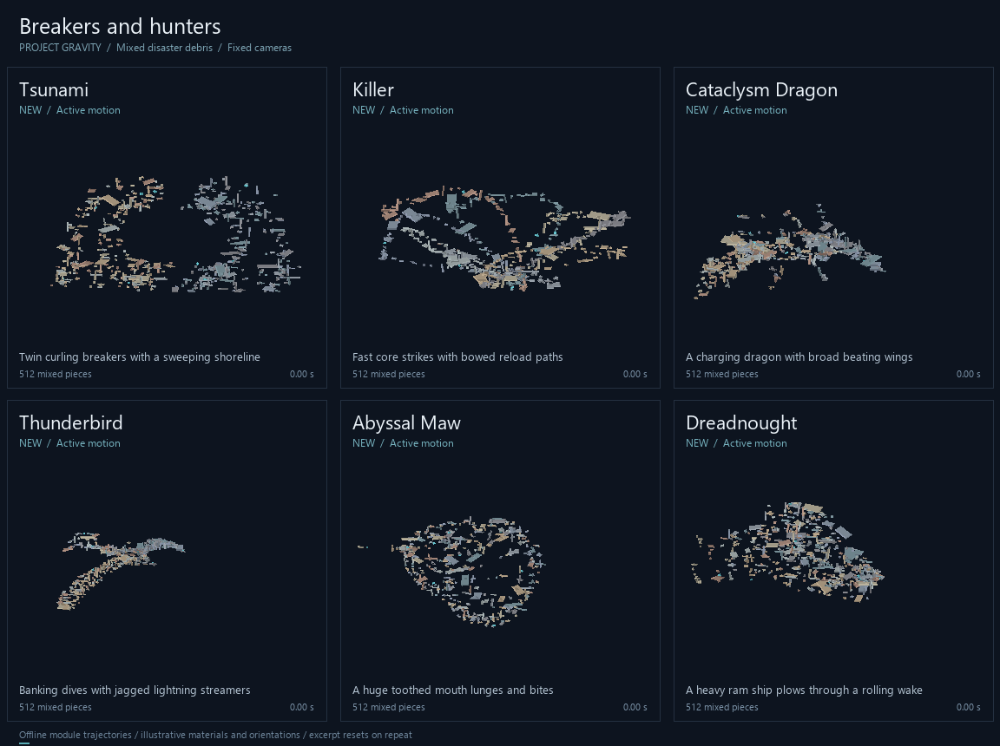
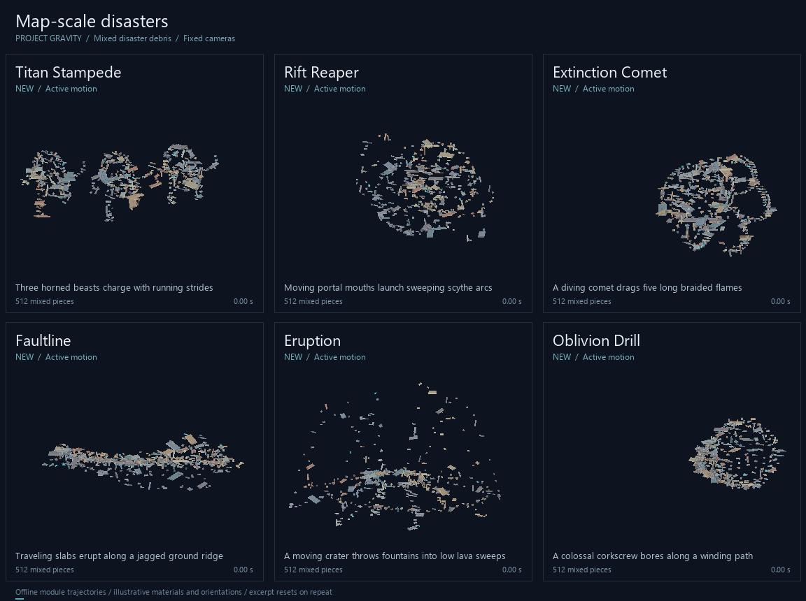

# Twelve moving disasters

**Tsunami and Killer follow the sketches in recommendations.** Ten more formations
join them in the desktop and mobile shape selectors, bringing the active catalog
to 87 at their introduction. The [thirty vast formations](VAST.md) expand it to
117. These are large moving arrangements of the mixed bricks, beams and panels
available in Natural Disaster Survival.

Each has seven controls. Move the existing core to position the action; the shape
also travels, strikes or sweeps around it on its own.

| Shape | What it does | Start with these controls |
| --- | --- | --- |
| **Tsunami** | Two mirrored walls climb into inward curling crests, break down the inner face and recirculate as low wash. The whole shoreline sweeps across the core. | Wave Reach, Wave Height, Surge Speed |
| **Killer** | Staggered debris streams dive through the core, overshoot and curve back for another rapid strike. | Attack Speed, Strike Reach, Strike Streams |
| **Cataclysm Dragon** | A huge bat-winged dragon charges through banking turns with wingbeats, a bending tail, jaws and dorsal spines. | Wing Reach, Charge Speed, Dive Depth |
| **Thunderbird** | Broad angular wings beat through banking dives, pulling three jagged lightning streamers behind them. | Wing Reach, Storm Speed, Lightning Tail Length |
| **Abyssal Maw** | A giant toothed mouth lunges and chomps ahead of a long, flexing body. | Mouth Radius, Lunge Speed, Chomp Depth % |
| **Dreadnought** | A heavy armored hull drives three extending battering prows through a rolling wake. | Hull Length, Ram Speed, Ram Reach |
| **Titan Stampede** | Three horned beasts charge together, with alternating legs, lifting feet and staggered strides. | Beast Scale, Stampede Speed, Stride Reach |
| **Rift Reaper** | Paired portal irises advance around the map while long scythe arcs sweep through and beyond the tunnel. | Portal Radius, Reaping Speed, Scythe Reach |
| **Extinction Comet** | A large comet dives along a broad route with a shock bow and five twisting flame tails. | Comet Radius, Dive Speed, Flame Tail Length |
| **Faultline** | A wide jagged ridge advances while successive slabs heave up and fracture edges sweep outward. | Rupture Width, Rupture Speed, Slab Height |
| **Eruption** | A moving crater throws eight fountains into rising arcs; debris returns in low lava sweeps. | Blast Reach, Eruption Speed, Fountain Height |
| **Oblivion Drill** | A tapered three-start corkscrew and cutting crown bore along a winding, rising route. | Drill Length, Boring Speed, Screw Turns |

## Motion previews

These clips execute the actual modules with 512 irregular pieces per formation,
60 Hz sampling and fixed cameras. Playback shows eight seconds at 12 fps.
Materials and piece orientations are illustrative. These are offline trajectories,
not Roblox recordings or collision simulations.





[All twelve at 512 pieces](disasters/gallery.png) ·
[Sparse preview at 160 pieces](disasters/gallery-sparse.png) ·
[Four snapshots of the hunters](disasters/contact-01.png) ·
[Four snapshots of the disasters](disasters/contact-02.png)

## Using them with disaster debris

Start with the defaults and reduce the main size controls if a round has little
rubble. Wide panels help fill wings, hulls and wave faces; large shapes become
more detailed with more pieces. Position the core near the island surface for
Tsunami, Faultline, Eruption and Titan Stampede, then use their height controls to
set the waterline, base or feet. Heights are relative to the core; these formations
do not raycast or reshape the terrain.

Killer aims at the core plus **Aim Height**. Its fast passes use full frame
tracking, and its animation rate reserves part of the global **Max Speed** budget
for following a moving core. Increase Max Speed to permit faster volleys, then
adjust Attack Speed. Existing core targeting and **Preserve Collisions** still
control aiming and original debris collision behavior.

Setting a shape's speed to zero holds its internal pose. Formation Time Scale can
slow, freeze or reverse the animation. The existing small shared motion offset
continues while the pattern is frozen; Full Pause uses the runtime's normal pause
behavior. Stable slot assignments keep the same anatomy when rubble is added or
removed, and large formations continue processing outside the normal radius.

## Validation and rebuild

The regression suite checks all twelve shapes with mixed debris, default and
extreme controls, late claims, frozen/reversed clocks, continuous trajectories,
and real loader/selector/velocity-loop execution for desktop and mobile.

```powershell
lune run tools/test_luau.luau tests/disaster_shapes.lua
lune run tools/test_luau.luau tests/controls_lint.lua
lune run tools/test_luau.luau tests/slider_range_lint.lua
python tools/preview_disasters.py
```

The renderer requires Lune 0.10+ and Pillow. It records per-shape settings, source
fingerprints and motion statistics in [manifest.json](disasters/manifest.json).
Live Roblox physics and network ownership require checking in a game session.
