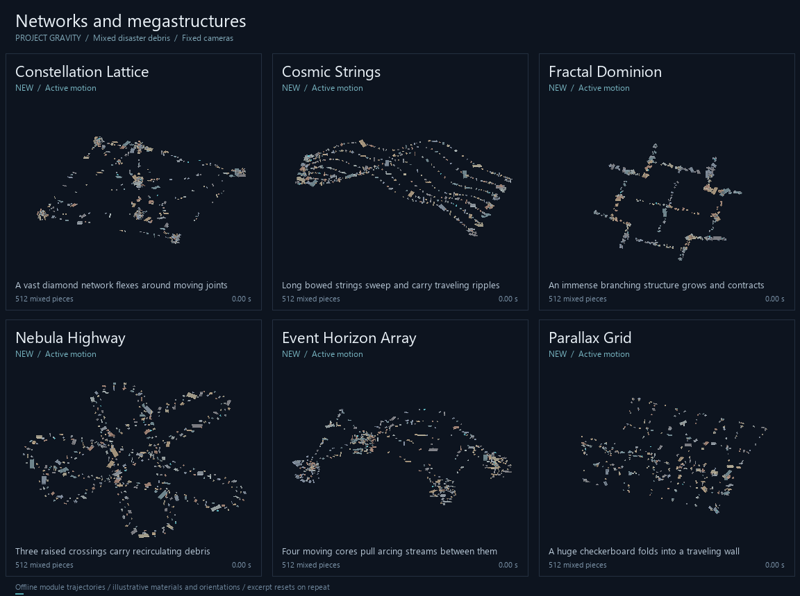
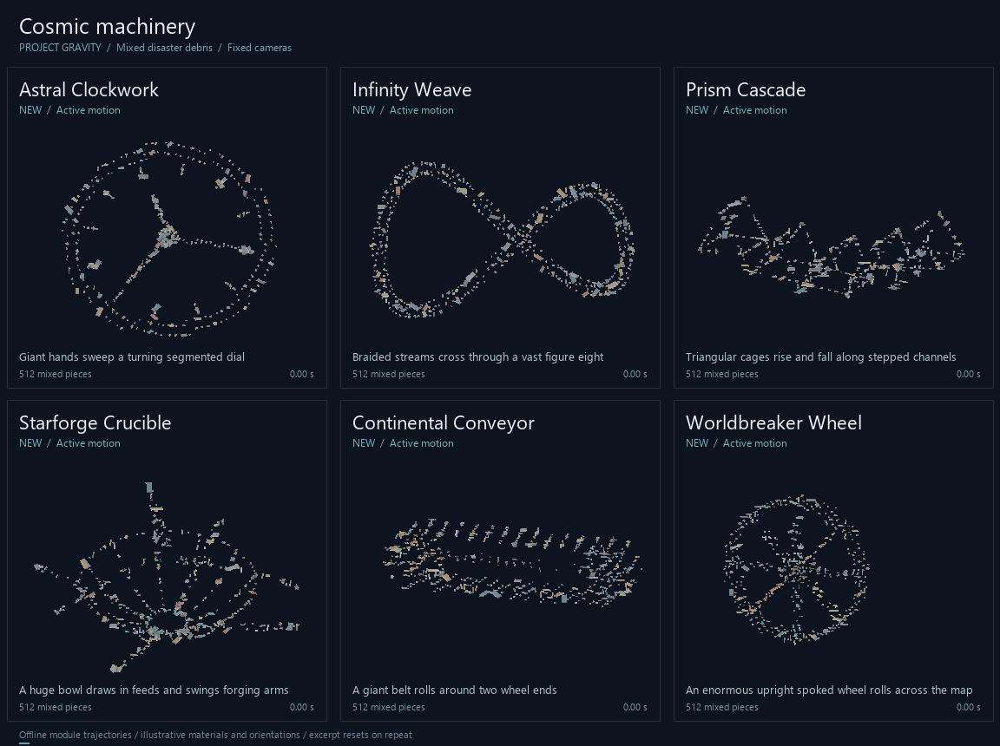
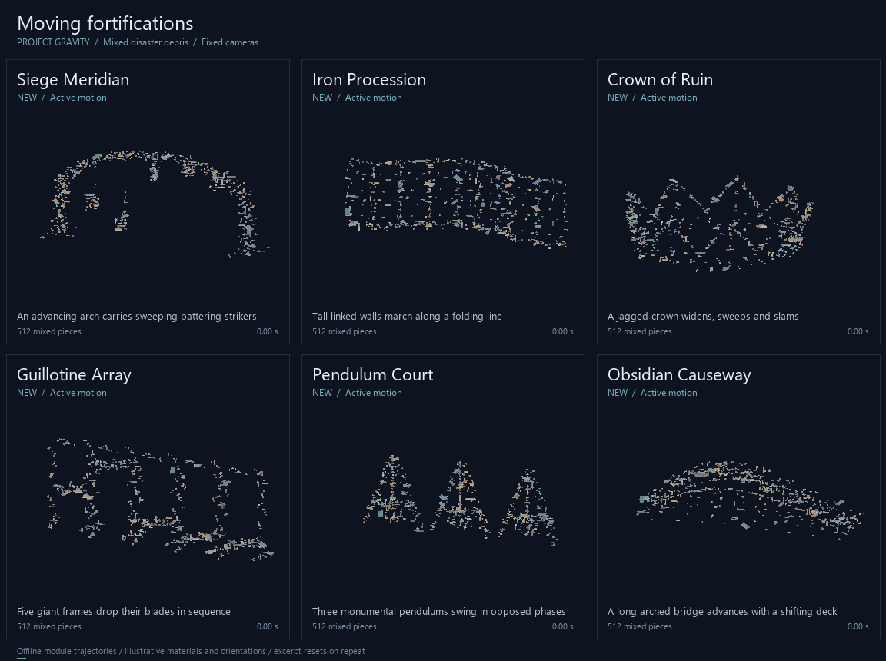
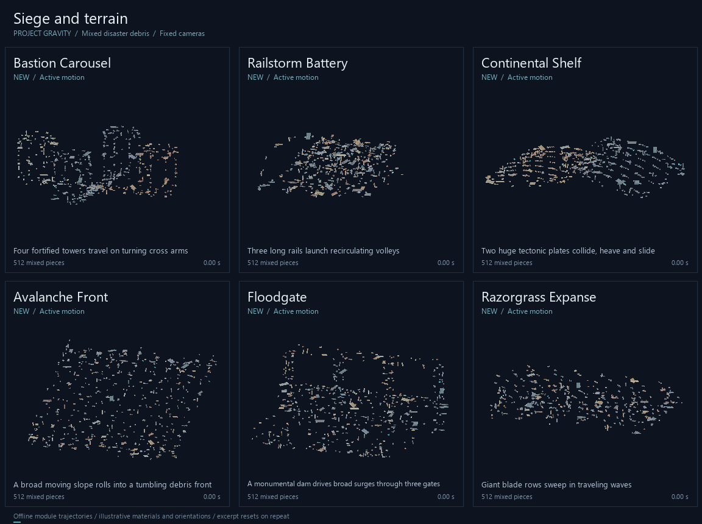
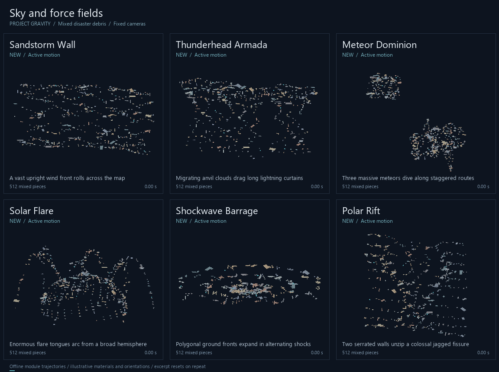

# Thirty vast formations

Thirty additional formations bring Project Gravity to **117 active shapes**. This set focuses on enormous networks, machines, fortifications and disaster fields. All have distinct geometry, active movement and five to seven controls.

For the feel of Galactic Web, start with **Constellation Lattice**, **Event Horizon Array** or **Fractal Dominion**. For broad moving structures, try **Parallax Grid**, **Iron Procession** and **Worldbreaker Wheel**. The earlier [Tsunami, Killer and ten companions](DISASTERS.md) remain available.

Select any name in the desktop or mobile shape selector. Most default footprints span roughly 500 to 1,100 studs. Reduce the main size controls when a round has little rubble; the 160-piece gallery shows the loss of detail at low counts.

## Motion galleries

These execute the actual modules with 512 mixed bricks, panels and beams, sampled at 60 Hz. Each fixed-camera GIF shows eight seconds at 12 fps. They illustrate trajectories; live physics, collisions and network ownership are not simulated.

### Networks and megastructures



| Shape | Structure and motion |
| --- | --- |
| **Constellation Lattice** | A vast diamond network flexes around moving joints. |
| **Cosmic Strings** | Long bowed strings sweep and carry traveling ripples. |
| **Fractal Dominion** | An immense branching structure grows and contracts. |
| **Nebula Highway** | Three raised crossings carry recirculating debris. |
| **Event Horizon Array** | Four moving cores pull arcing streams between them. |
| **Parallax Grid** | A huge checkerboard folds into a traveling wall. |

[Four motion snapshots](vast/contact-01.png)

### Cosmic machinery



| Shape | Structure and motion |
| --- | --- |
| **Astral Clockwork** | Giant hands sweep a turning segmented dial. |
| **Infinity Weave** | Braided streams cross through a vast figure eight. |
| **Prism Cascade** | Triangular cages rise and fall along stepped channels. |
| **Starforge Crucible** | A huge bowl draws in feeds and swings forging arms. |
| **Continental Conveyor** | A giant belt rolls around two wheel ends. |
| **Worldbreaker Wheel** | An enormous upright spoked wheel rolls across the map. |

[Four motion snapshots](vast/contact-02.png)

### Moving fortifications



| Shape | Structure and motion |
| --- | --- |
| **Siege Meridian** | An advancing arch carries sweeping battering strikers. |
| **Iron Procession** | Tall linked walls march along a folding line. |
| **Crown of Ruin** | A jagged crown widens, sweeps and slams. |
| **Guillotine Array** | Five giant frames drop their blades in sequence. |
| **Pendulum Court** | Three monumental pendulums swing in opposed phases. |
| **Obsidian Causeway** | A long arched bridge advances with a shifting deck. |

[Four motion snapshots](vast/contact-03.png)

### Siege and terrain



| Shape | Structure and motion |
| --- | --- |
| **Bastion Carousel** | Four fortified towers travel on turning cross arms. |
| **Railstorm Battery** | Three long rails launch recirculating volleys. |
| **Continental Shelf** | Two huge tectonic plates collide, heave and slide. |
| **Avalanche Front** | A broad moving slope rolls into a tumbling debris front. |
| **Floodgate** | A monumental dam drives broad surges through three gates. |
| **Razorgrass Expanse** | Giant blade rows sweep in traveling waves. |

[Four motion snapshots](vast/contact-04.png)

### Sky and force fields



| Shape | Structure and motion |
| --- | --- |
| **Sandstorm Wall** | A vast upright wind front rolls across the map. |
| **Thunderhead Armada** | Migrating anvil clouds drag long lightning curtains. |
| **Meteor Dominion** | Three massive meteors dive along staggered routes. |
| **Solar Flare** | Enormous flare tongues arc from a broad hemisphere. |
| **Shockwave Barrage** | Polygonal ground fronts expand in alternating shocks. |
| **Polar Rift** | Two serrated walls unzip a colossal jagged fissure. |

[Four motion snapshots](vast/contact-05.png)

## Debris and controls

[All thirty at 512 pieces](vast/gallery.png) · [All thirty at 160 pieces](vast/gallery-sparse.png)

These formations use stable per-part assignments, so a new claim joins the current pattern without shuffling the existing debris. Large structures keep processing beyond the normal radius. Their speed sliders control both structural movement and flowing parts; zero freezes the internal pattern, while the existing small shared motion offset remains active. Formation Time Scale supports slow motion and reversal.

Place the core at the intended ground level for the wheel, bridge, walls and ground fronts. Other forms expose height controls relative to the core. They arrange owned debris rather than raycasting or deforming terrain. Existing core positioning, targeting and collision controls remain available.

## Verification and rebuild

The regression suite covers finite targets and velocities, working controls, sparse claim IDs, deterministic slots, extreme settings, pause/reversal, substantial continuous movement, and the real loader, selector and velocity loop on desktop and mobile.

```powershell
lune run tools/test_luau.luau tests/disaster_shapes.lua vast
lune run tools/test_luau.luau tests/controls_lint.lua
lune run tools/test_luau.luau tests/slider_range_lint.lua
python tools/preview_disasters.py --collection vast
```

The preview tool requires Lune 0.10+ and Pillow. [The manifest](vast/manifest.json) records configurations, source fingerprints and movement statistics. Live NDS behavior still needs verification in a Roblox session.
